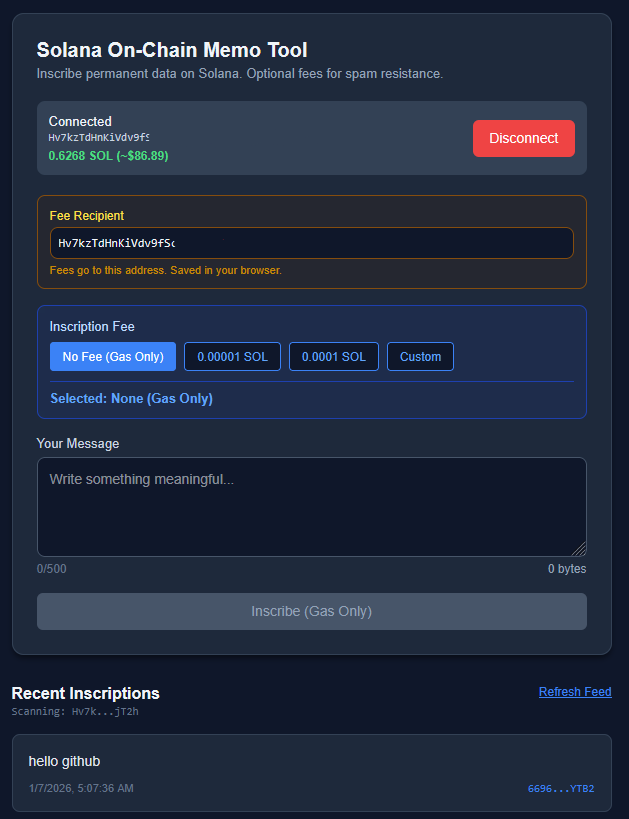

A vibe coded demo showing how small chunks of data >560 bytes can be inscribed and then fetched from the blockchain on solana. 

This demo gets memo data through recent transactions of the recepiants wallet.

